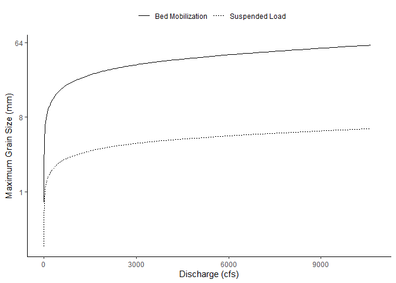

Simple Cross Section Hydraulics using Manning’s Equation
================

The **`xsmatic`** package contains generic functions for conducting
Manning’s equation hydraulic analyses based on surveyed cross section
data:

- Clean up station-elevation table and densify coordinate points

- Calculate hydraulic geometry (cross-sectional area, wetted perimeter)
  for a given water surface elevation.

- Using Manning’s *n* and a provided slope and roughness, calculate a
  rating curve of water surface elevation versus cross-sectional area,
  wetted perimeter, velocity, and discharge.

- Use a rating curve to return a water surface elevation for a given
  discharge value.

To install the package:

``` r
# authenticate with a github account within the FlowWest organization
usethis::use_git_config(user.name = "yourGithubUsername", user.email = "email@flowwest.com")
usethis::create_github_token() # copy the personal access token and paste below

# install private package
devtools::install_github(repo = "flowwest/xsmatic", 
                         auth_token = "TOKEN-HERE")
```

Load the package:

``` r
library(tidyverse)
library(xsmatic)
```

Run via the interactive prompt (also published at
[flowwest.shinyapps.io/xsmatic](https://flowwest.shinyapps.io/xsmatic)):

``` r
xs_run_app()
```

Import cross sections:

``` r
xs_2007 <- read_csv("data-raw/xs_2007.csv") %>%
  xs_prep(sta = station_ft, elev = elevation_ft) 
xs_2023 <- read_csv("data-raw/xs_2023_simplified.csv") %>%
  xs_prep(sta = station_ft, elev = elevation_ft) 

xs_plot2(xs_2007, xs_2023)
```

<!-- -->

Calculate rating curves:

``` r
rc_2007 <- xs_2007 %>% 
  xs_rating_curve(slope = 0.021, mannings_n = 0.035)
rc_2023 <- xs_2023 %>% 
  xs_rating_curve(slope = 0.021, mannings_n = 0.035)

xs_plot_rc2(rc_2007, rc_2023)
```

<!-- -->

Calculate water surface elevation at given discharge

``` r
q100 <- 3980 # cfs
wse_2007 <- rc_2007 %>% xs_rc_interpolate(q100)
wse_2023 <- rc_2023 %>% xs_rc_interpolate(q100)

xs_plot2(xs_2007, xs_2023, wse_2007, wse_2023)
```

<!-- -->

Calculate hydraulic parameters at multiple discharges

``` r
xs_eval_all(xs = xs_2023, rc = rc_2023, 
            discharges = c("Q2"=513, "Q5"=1320, "Q10"=1970, "Q25"=2780, "Q50"=3360, "Q100"=3980))
```

| name | discharge | thalweg_elevation | water_surface_elevation | max_depth | cross_sectional_area | wetted_perimeter | velocity |
|:-----|----------:|------------------:|------------------------:|----------:|---------------------:|-----------------:|---------:|
| Q2   |       513 |             36.99 |                   41.24 |      4.25 |             47.22972 |         20.87879 | 10.86181 |
| Q5   |      1320 |             36.99 |                   43.44 |      6.45 |             95.12741 |         28.59194 | 13.87613 |
| Q10  |      1970 |             36.99 |                   44.74 |      7.75 |            128.97752 |         32.37290 | 15.27398 |
| Q25  |      2780 |             36.99 |                   46.04 |      9.05 |            165.48131 |         36.03294 | 16.79948 |
| Q50  |      3360 |             36.99 |                   46.84 |      9.85 |            189.26527 |         38.38498 | 17.75286 |
| Q100 |      3980 |             36.99 |                   47.64 |     10.65 |            214.05067 |         40.61888 | 18.59373 |

Quick sediment transport estimates

``` r
xs_eval_all(xs = xs_2023, rc = rc_2023, 
            discharges = c("Q2"=513, "Q5"=1320, "Q10"=1970, "Q25"=2780, "Q50"=3360, "Q100"=3980),
            sediment_transport = TRUE, slope = 0.021)
```

| name | discharge | thalweg_elevation | water_surface_elevation | max_depth | cross_sectional_area | wetted_perimeter | velocity | hydraulic_radius | critical_shields_number | grain_size_mobilized_mm | shear_velocity | grain_size_suspended_mm |
|:-----|----------:|------------------:|------------------------:|----------:|---------------------:|-----------------:|---------:|-----------------:|------------------------:|------------------------:|---------------:|------------------------:|
| Q2   |       513 |             36.99 |                   41.24 |      4.25 |             47.22972 |         20.87879 | 10.86181 |         2.262090 |               0.0571013 |                16.54186 |       4.056736 |                2.222809 |
| Q5   |      1320 |             36.99 |                   43.44 |      6.45 |             95.12741 |         28.59194 | 13.87613 |         3.327071 |               0.0571013 |                24.32968 |       4.919860 |                2.968699 |
| Q10  |      1970 |             36.99 |                   44.74 |      7.75 |            128.97752 |         32.37290 | 15.27398 |         3.984120 |               0.0571013 |                29.13444 |       5.383788 |                3.398357 |
| Q25  |      2780 |             36.99 |                   46.04 |      9.05 |            165.48131 |         36.03294 | 16.79948 |         4.592500 |               0.0571013 |                33.58331 |       5.780246 |                3.780563 |
| Q50  |      3360 |             36.99 |                   46.84 |      9.85 |            189.26527 |         38.38498 | 17.75286 |         4.930712 |               0.0571013 |                36.05653 |       5.989306 |                3.987511 |
| Q100 |      3980 |             36.99 |                   47.64 |     10.65 |            214.05067 |         40.61888 | 18.59373 |         5.269733 |               0.0571013 |                38.53567 |       6.191787 |                4.191419 |

``` r
xs_plot_sediment(xs = xs_2023, rc = rc_2023, slope = 0.021)
```

<!-- -->
