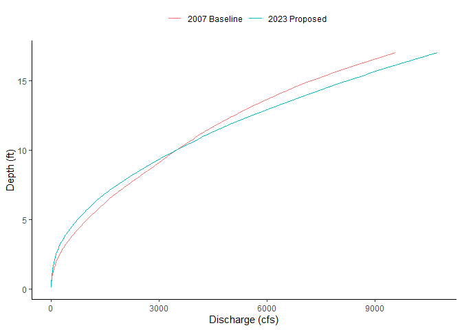
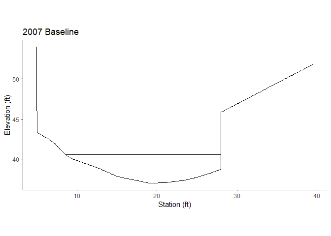

MECC Hydraulic Analysis
================
FlowWest
12 June 2023

``` r
library(tidyverse)
ggplot2::theme_set(theme_classic())
```

## Import cross sections

``` r
prep_xs <- function(data, sta, elev, delta_x=0.1) {
  result <- data %>%
    arrange({{sta}}) %>%
    mutate(sta = {{sta}}) %>%
    complete(sta = seq(from = min({{sta}}), to = max({{sta}}), by = delta_x)) %>%
    mutate(gse = zoo::na.approx({{elev}}, x = sta)) %>% 
    select(c(sta, gse))
  
  # further densify in the vertical direction
  d <- result %>% 
      arrange(-sta) %>%
      mutate(delta_x = abs(lag(sta, 1) - sta),
             delta_z = abs(lag(gse, 1) - gse),
             multiplier = replace_na(ceiling(delta_z/delta_x),1)) %>% 
      arrange(sta)
  idx <- rep(1:nrow(d), d$multiplier)
  return(
    d[idx,] %>% 
    mutate(gse = case_when(duplicated(sta) ~ NA, TRUE ~ gse),
           sta = case_when(duplicated(sta) ~ NA, TRUE ~ sta)) %>%
    mutate(gse = zoo::na.approx(gse, na.rm = FALSE),
           sta = zoo::na.approx(sta, na.rm = FALSE)) %>%
    select(sta, gse) %>% drop_na() 
  )
  
}
```

``` r
xs_2007 <- read_csv("data/xs_2007.csv") %>%
  prep_xs(sta = station_ft, elev = elevation_ft) 

xs_2007 %>% ggplot(aes(y = gse, x = sta)) + geom_point() + 
  ylab("Elevation (ft)") + xlab("Station (ft)") + ggtitle("2007 Baseline") + coord_fixed(ratio = 1)
```

<!-- -->

``` r
xs_2023 <- read_csv("data/xs_2023_simplified.csv") %>% #_simplified.csv") %>%
  prep_xs(sta = station_ft, elev = elevation_ft) 

xs_2023 %>% ggplot(aes(y = gse, x = sta)) + geom_point() + 
  ylab("Elevation (ft)") + xlab("Station (ft)") + ggtitle("2023 Proposed") + coord_fixed(ratio = 1)
```

<!-- -->

``` r
ggplot() + 
  geom_line(data = xs_2007, aes(x = sta, y = gse, color = "2007 Baseline")) +
  geom_line(data = xs_2023, aes(x = sta, y = gse, color = "2023 Proposed")) +
  ylab("Elevation (ft)") + xlab("Station (ft)") + theme(legend.position="top", legend.title=element_blank())  + coord_fixed(ratio = 1)
```

<!-- -->

## Calculate depth-discharge rating curves

``` r
model_slope <- (38.6-38.0) / 28.65

model_roughness <- 0.035 # n

print(c("model_slope" = model_slope, "model_roughness" = model_roughness))
```

    ##     model_slope model_roughness 
    ##      0.02094241      0.03500000

Future improvement to script should allow different slope and roughness
for each scenario.

``` r
calc_xs <- function(data, water_elev) {
  data %>% 
    arrange(sta) %>%
    mutate(wse = case_when(water_elev > gse ~ water_elev),
           delta_x = abs(lag(sta, 1) - sta),
           delta_z = abs(lag(gse, 1) - gse),
           depth = wse - gse, 
           hyp_length = sqrt(delta_x^2 + delta_z^2)
    ) %>%
    filter(!is.na(wse)) %>% 
    summarize(thalweg_elevation = min(gse),
              water_surface_elevation = water_elev,
              max_depth = water_surface_elevation - thalweg_elevation,
              cross_sectional_area = sum(delta_x * depth),
              wetted_perimeter = sum(hyp_length)
    ) %>% 
    as.list() %>% 
    list_flatten()
}

calculate_rating_curve <- function(data, slope, mannings_n, delta_y=0.1) {
  depth_vs_wse <- seq(from=min(data$gse)+delta_y, to=max(data$gse), by=delta_y) %>% 
    as_tibble() %>%
    mutate(result = map(value, function(x){calc_xs(data = data, water_elev = x)})) %>% 
    unnest_wider(col = result) %>%
    drop_na() %>%
    mutate(discharge_cfs = 1.486 * cross_sectional_area * 
             (cross_sectional_area / wetted_perimeter)^(2/3) * slope^(1/2) * mannings_n^(-1),
           velocity_ft_s = discharge_cfs / cross_sectional_area) %>%
    arrange(discharge_cfs)
}
```

``` r
depth_vs_discharge_2007 <- xs_2007 %>% 
  calculate_rating_curve(slope = model_slope,
                         mannings_n = model_roughness) # 0.030) #model_roughness)
depth_vs_discharge_2007 %>% 
  ggplot(aes(y = max_depth, x = discharge_cfs)) + 
  geom_line() + ylab("Depth (ft)") + xlab("Discharge (cfs)") + ggtitle("2007 Baseline")
```

<!-- -->

``` r
depth_vs_discharge_2023 <- xs_2023 %>% 
  calculate_rating_curve(slope = model_slope,
                         mannings_n = model_roughness)
depth_vs_discharge_2023 %>% 
  ggplot(aes(y = max_depth, x = discharge_cfs)) + 
  geom_line() + ylab("Depth (ft)") + xlab("Discharge (cfs)") + ggtitle("2023 Proposed") 
```

<!-- -->

``` r
ggplot() +
  geom_line(data = depth_vs_discharge_2007, aes(y = max_depth, x = discharge_cfs, color = "2007 Baseline")) +
  geom_line(data = depth_vs_discharge_2023, aes(y = max_depth, x = discharge_cfs, color = "2023 Proposed")) + 
  ylab("Depth (ft)") + xlab("Discharge (cfs)") + theme(legend.position="top", legend.title=element_blank())
```

<!-- -->

``` r
ggplot() +
  geom_line(data = depth_vs_discharge_2007, aes(y = water_surface_elevation, x = discharge_cfs, color = "2007 Baseline")) +
  geom_line(data = depth_vs_discharge_2023, aes(y = water_surface_elevation, x = discharge_cfs, color = "2023 Proposed")) + 
  ylab("Water Surface Elevation (ft)") + xlab("Discharge (cfs)") + theme(legend.position="top", legend.title=element_blank())
```

<!-- -->

Future improvement to script should include functions for the following
analyses to avoid duplication.

## Q100

### Interpolate water surface for selected discharge

``` r
model_discharge <- 3980 # cfs
```

``` r
interpolate_rating_curve <- function(data, discharge) {
  data %>%
    bind_rows(tribble(~selected_water_level, ~discharge_cfs, TRUE, discharge)) %>%
    arrange(discharge_cfs) %>%
    mutate(output_wse = zoo::na.approx(water_surface_elevation)) %>%
    filter(selected_water_level) %>% 
    pull(output_wse)
}
```

``` r
wse_2007 <- depth_vs_discharge_2007 %>% interpolate_rating_curve(model_discharge)
print(c("wse 2007" = wse_2007))
```

    ## wse 2007 
    ##    47.84

``` r
wse_2023 <- depth_vs_discharge_2023 %>% interpolate_rating_curve(model_discharge)
print(c("wse 2023" = wse_2023))
```

    ## wse 2023 
    ##    47.64

``` r
xs_2007 %>% calc_xs(wse_2007)
```

    ## $thalweg_elevation
    ## [1] 36.99
    ## 
    ## $water_surface_elevation
    ## [1] 47.84
    ## 
    ## $max_depth
    ## [1] 10.85
    ## 
    ## $cross_sectional_area
    ## [1] 214.2417
    ## 
    ## $wetted_perimeter
    ## [1] 40.73901

``` r
xs_2023 %>% calc_xs(wse_2023)
```

    ## $thalweg_elevation
    ## [1] 36.99
    ## 
    ## $water_surface_elevation
    ## [1] 47.64
    ## 
    ## $max_depth
    ## [1] 10.65
    ## 
    ## $cross_sectional_area
    ## [1] 214.0507
    ## 
    ## $wetted_perimeter
    ## [1] 40.61888

### Plot outputs

``` r
xs_2007 %>% arrange(sta) %>%
      mutate(wse = case_when(wse_2007 > gse ~ wse_2007)) %>%
      ggplot(aes(x = sta)) + 
      geom_line(aes(y = gse)) + 
      geom_line(aes(y = wse)) + 
      xlab("Station (ft)") + ylab("Elevation (ft)") + ggtitle("2007 Baseline") + coord_fixed(ratio = 1)
```

<!-- -->

``` r
xs_2023 %>% arrange(sta) %>%
      mutate(wse = case_when(wse_2023 > gse ~ wse_2023)) %>%
      ggplot(aes(x = sta)) + 
      geom_line(aes(y = gse)) + 
      geom_line(aes(y = wse)) + 
      xlab("Station (ft)") + ylab("Elevation (ft)") + ggtitle("2023 Proposed") + coord_fixed(ratio = 1)
```

<!-- -->

``` r
ggplot() + 
  geom_line(data = xs_2007, aes(x = sta, y = gse, color = "2007 Baseline", linetype = "Terrain")) +
  geom_line(data = xs_2023, aes(x = sta, y = gse, color = "2023 Proposed", linetype = "Terrain")) +
  geom_line(data = xs_2007, aes(x = sta, y = case_when(wse_2007 > gse ~ wse_2007), 
                                color = "2007 Baseline", linetype = "Water Surface")) + 
  geom_line(data = xs_2023, aes(x = sta, y = case_when(wse_2023 > gse ~ wse_2023), 
                                color = "2023 Proposed", linetype = "Water Surface")) + 
      xlab("Station (ft)") + ylab("Elevation (ft)") + theme(legend.position="top", legend.title=element_blank()) + coord_fixed(ratio = 1)
```

<!-- -->

### Calculate design velocity based on Q100 flow

``` r
velocity_2007 <- model_discharge / calc_xs(xs_2007, wse_2007)$cross_sectional_area
print(velocity_2007)
```

    ## [1] 18.57715

``` r
velocity_2023 <- model_discharge / calc_xs(xs_2023, wse_2023)$cross_sectional_area
print(velocity_2023)
```

    ## [1] 18.59373

## Q2

### Interpolate water surface for selected discharge

``` r
model_discharge <- 513 # cfs
```

``` r
wse_2007_Q2 <- depth_vs_discharge_2007 %>% interpolate_rating_curve(model_discharge)
print(c("wse 2007" = wse_2007_Q2))
```

    ## wse 2007 
    ##    40.54

``` r
wse_2023_Q2 <- depth_vs_discharge_2023 %>% interpolate_rating_curve(model_discharge)
print(c("wse 2023" = wse_2023_Q2))
```

    ## wse 2023 
    ##    41.24

``` r
xs_2007 %>% calc_xs(wse_2007_Q2)
```

    ## $thalweg_elevation
    ## [1] 36.99
    ## 
    ## $water_surface_elevation
    ## [1] 40.54
    ## 
    ## $max_depth
    ## [1] 3.55
    ## 
    ## $cross_sectional_area
    ## [1] 48.38457
    ## 
    ## $wetted_perimeter
    ## [1] 22.13284

``` r
xs_2023 %>% calc_xs(wse_2023_Q2)
```

    ## $thalweg_elevation
    ## [1] 36.99
    ## 
    ## $water_surface_elevation
    ## [1] 41.24
    ## 
    ## $max_depth
    ## [1] 4.25
    ## 
    ## $cross_sectional_area
    ## [1] 47.22972
    ## 
    ## $wetted_perimeter
    ## [1] 20.87879

### Plot outputs

``` r
xs_2007 %>% arrange(sta) %>%
      mutate(wse = case_when(wse_2007_Q2 > gse ~ wse_2007_Q2)) %>%
      ggplot(aes(x = sta)) + 
      geom_line(aes(y = gse)) + 
      geom_line(aes(y = wse)) + 
      xlab("Station (ft)") + ylab("Elevation (ft)") + ggtitle("2007 Baseline") + coord_fixed(ratio = 1)
```

<!-- -->

``` r
xs_2023 %>% arrange(sta) %>%
      mutate(wse = case_when(wse_2023_Q2 > gse ~ wse_2023_Q2)) %>%
      ggplot(aes(x = sta)) + 
      geom_line(aes(y = gse)) + 
      geom_line(aes(y = wse)) + 
      xlab("Station (ft)") + ylab("Elevation (ft)") + ggtitle("2023 Proposed") + coord_fixed(ratio = 1)
```

<!-- -->

``` r
ggplot() + 
  geom_line(data = xs_2007, aes(x = sta, y = gse, color = "2007 Baseline", linetype = "Terrain")) +
  geom_line(data = xs_2023, aes(x = sta, y = gse, color = "2023 Proposed", linetype = "Terrain")) +
  geom_line(data = xs_2007, aes(x = sta, y = case_when(wse_2007_Q2 > gse ~ wse_2007_Q2), 
                                color = "2007 Baseline", linetype = "Water Surface")) + 
  geom_line(data = xs_2023, aes(x = sta, y = case_when(wse_2023_Q2 > gse ~ wse_2023_Q2), 
                                color = "2023 Proposed", linetype = "Water Surface")) + 
      xlab("Station (ft)") + ylab("Elevation (ft)") + theme(legend.position="top", legend.title=element_blank()) + coord_fixed(ratio = 1)
```

<!-- -->

### Calculate design velocity based on Q2 flow

``` r
velocity_2007_Q2 <- model_discharge / calc_xs(xs_2007, wse_2007_Q2)$cross_sectional_area
print(velocity_2007_Q2)
```

    ## [1] 10.60255

``` r
velocity_2023_Q2 <- model_discharge / calc_xs(xs_2023, wse_2023_Q2)$cross_sectional_area
print(velocity_2023_Q2)
```

    ## [1] 10.86181

## Output design velocity tables

Calculate design velocities based on all modeled flood events from Q2 to
Q100

``` r
streamstats_result <- tribble(~return_interval, ~discharge,
                              2 ,   513,
                              5,   1320,
                              10,  1970,
                              25,  2780,
                              50,  3360,
                              100, 3980 ) 

velocities <- streamstats_result %>%
  mutate(xs_area_2007 = map_dbl(discharge, function(discharge) {depth_vs_discharge_2007 %>% interpolate_rating_curve(., discharge) %>% calc_xs(xs_2007, .) %>% .$cross_sectional_area}),
         xs_area_2023 = map_dbl(discharge, function(discharge) {depth_vs_discharge_2023 %>% interpolate_rating_curve(., discharge) %>% calc_xs(xs_2023, .) %>% .$cross_sectional_area}),
         velocity_2007 = discharge / xs_area_2007,
         velocity_2023 = discharge / xs_area_2023
         )
velocities %>% knitr::kable()
```

| return_interval | discharge | xs_area_2007 | xs_area_2023 | velocity_2007 | velocity_2023 |
|----------------:|----------:|-------------:|-------------:|--------------:|--------------:|
|               2 |       513 |     48.38457 |     47.22972 |      10.60255 |      10.86181 |
|               5 |      1320 |     95.81888 |     95.12741 |      13.77599 |      13.87613 |
|              10 |      1970 |    125.46387 |    128.97752 |      15.70173 |      15.27398 |
|              25 |      2780 |    159.92333 |    165.48131 |      17.38333 |      16.79948 |
|              50 |      3360 |    185.94605 |    189.26527 |      18.06976 |      17.75286 |
|             100 |      3980 |    214.24166 |    214.05067 |      18.57715 |      18.59373 |
